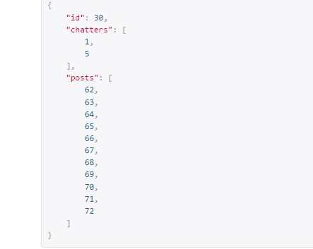
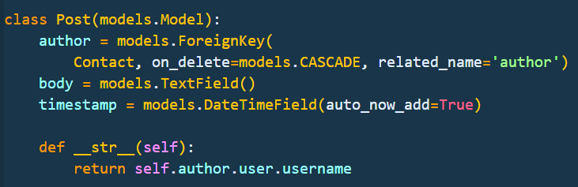
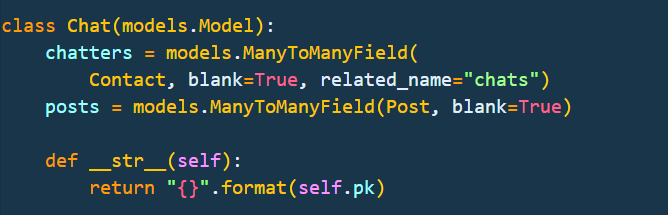

# Chat Application
### Video Demo: [URL](https://youtu.be/SlBbjueHNPo)
## Technologies used:
* Python (Django)
* Javascript
* HTML
* CSS
* Bootstrap
* WebSockets
* Redis
## Installation
### Video Installation: [URL](https://youtu.be/byJrt374Bh0)
* cd capstone (make sure you are inside the folder $capstone)
* sudo apt-get install redis
* pip install virtualenv
### Create a virtual environment
#### to create:
* virtualenv env
#### to run:
* source env/bin/activate
* pip install django
* pip install channels['daphne']
* pip install humanize
* pip install djangorestframework
* pip install channels_redis
* redis-server (make sure Redis server is running on port: 6379)
#### open a new terminal
* cd capstone
* source env/bin/activate
* cd capstone
* python manage.py runserver (inside $(env)capstone/capstone)
## Description:
* My final project is a web chat application created using HTML, CSS, Python and Javascript. I've used Django web framework based in Python for the backend. The database is default sqlite3 using models. I've also used Bootstrap and CSS for styling purposes.
* Chat App is my version of Messenger. Messenger is a proprietary instant messaging app and platform developed by Meta Platforms. It is a generic chat app, that is using WebSocket for a real-time chat experience.
## Distinctiveness and Complexity
* My application is completely different from the project we encounter before. I try to use as many new things as I was able to.
* My application is not based on the Pizza project or any other projects we did before.
* It utilizes Django, including 3 models Chat, Post, Contact plus a basic User model and JavaScript on the front-end.
* My application is mobile-responsive.
* I believe that this application was challenging and meets all the requirements.

## Files and directories
### chat/static/chat
#### /index.js
* In JavaScript first thing we do is create WebSocket that takes chat id as a roomName argument to create individual layers for each chat.
* In case of a connection error it's sending a consol.log message and alert to the user.
* When sending a new message create a new document object that is segregated either to left or right, depending on whom sends the message.
* When sending the message to Consumer.py it also sends chat_id and user_id so the message can be saved in the database.
* Each time message is sent scrollDown function is triggered to make the user feel like the application is responsive.
#### /styles.css
* Contains styling of the HTML templates.
### chat/static/templates
#### /base.html
* Contains links to Bootstrap CDN, Google fonts, Bootstrap icons, static files and title.
#### /chat.html
* Shows chat template with messages between users. Create a user list on the left and generate current chat messages.
#### /index.html
* Shows a list of users you can choose to start a chat with.
#### /login.html
* login template.
#### /register.html
* register template.

### chat/
#### /consumers.py
* Contains ChatConsumer class that manages the WebsocketConsumer.
* While receiving the message, a New post object is created and added to the chat.
* JSON data is sent back to the receiver so the message can appear on the right side of the chat app.
#### /views.py
* Respectively, contains all application views.
* On the index page we are rendering only contacts that are appearing on the right side of the screen.
* When the Contact avatar is clicked, we are either getting a chat when chatters are users and contact or creating a new chat if the chat doesn't exist in the first place.
* Posts are being filtered for the ones that are in the chat and then further in jinja plates, we segregate them to left and right, depending if the user is the sender or receiver.
* Chat id is also being sent to the frontend as a room_name so we can get the id for the WebSocket port.
* Chat Url is constructed from contact id and user in a way that any other than your chats can't be accessed.
* There is also a chat API rest view set up at ....chat_api/ even though it's not used, it help me understand what was going on.
* When the User is registering, a contact profile is also created.
* While login in user status is changed to online, and while login out user status is changed to offline.
#### /models.py
* There are 3 models besides basic User(Contact, Post and Chat).
* Chat is storing 2 contacts IDs and posts IDs that were sent during this chat.

* Contact model stores when the user last login, status(if a user is online or offline) and profile image.

* Post model is storing the author of the post, body, and timestamp.

#### /admin.py
* Here I register three admin classes Chat, Contact, Post
#### /serializers.py
* Here I create serializers for my models.
#### /routing.py
* contains a unique URL for WebSocket connection that takes room_name argument.
#### /urls.py
* all application URLs.

### capstone/
#### /asgi.py
* Initialize Django ASGI application.
#### /settings.py
* I added installed apps.

### images/
* Contains images for README file.

### CSS/Bootstrap
* Application was made using Bootstrap 5.
* Design is simple and supposed to resemble Messenger feel like.
* For a font family I am using Lato for a better user experience.
* Application is responsive and has simple animation.

### Database
* I am using the default sqlite3 database.

## Credits
* WebSockets were installed using channels documentation [URL](https://channels.readthedocs.io/)
* User avatars are random pictures from  [URL](https://www.google.com/)

